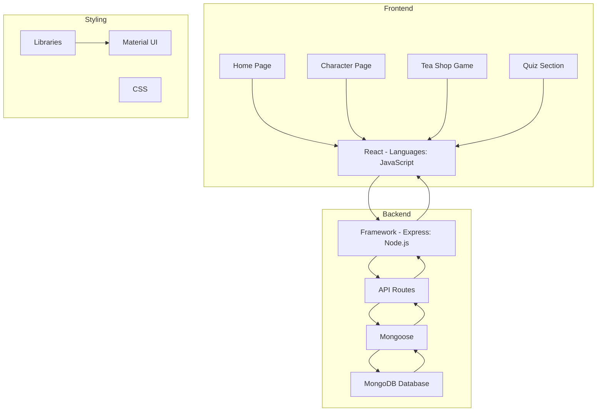

```mermaid
graph TD;
    subgraph Frontend
        A[React - Languages: JavaScript] 
        B[Home Page]
        C[Character Page]
        D[Tea Shop Game]
        E[Quiz Section]
    end
    subgraph Backend
        F[Framework - Express: Node.js] --> G[API Routes]
        G --> H[Mongoose]
        H --> I[MongoDB Database]
    end
    A --> F
    F --> A
    H--> G
    I --> H
    G --> F

    subgraph Styling
        J[Libraries] --> K[Material UI]
        L[CSS]
     
    end

    B --> A
    C --> A
    D --> A
    E --> A


```
