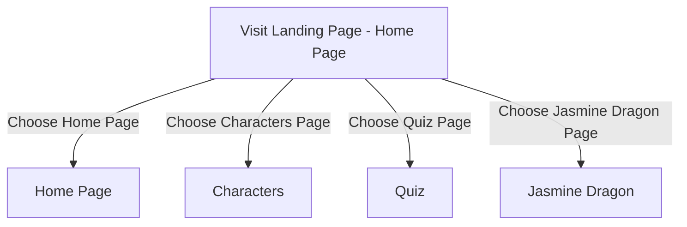
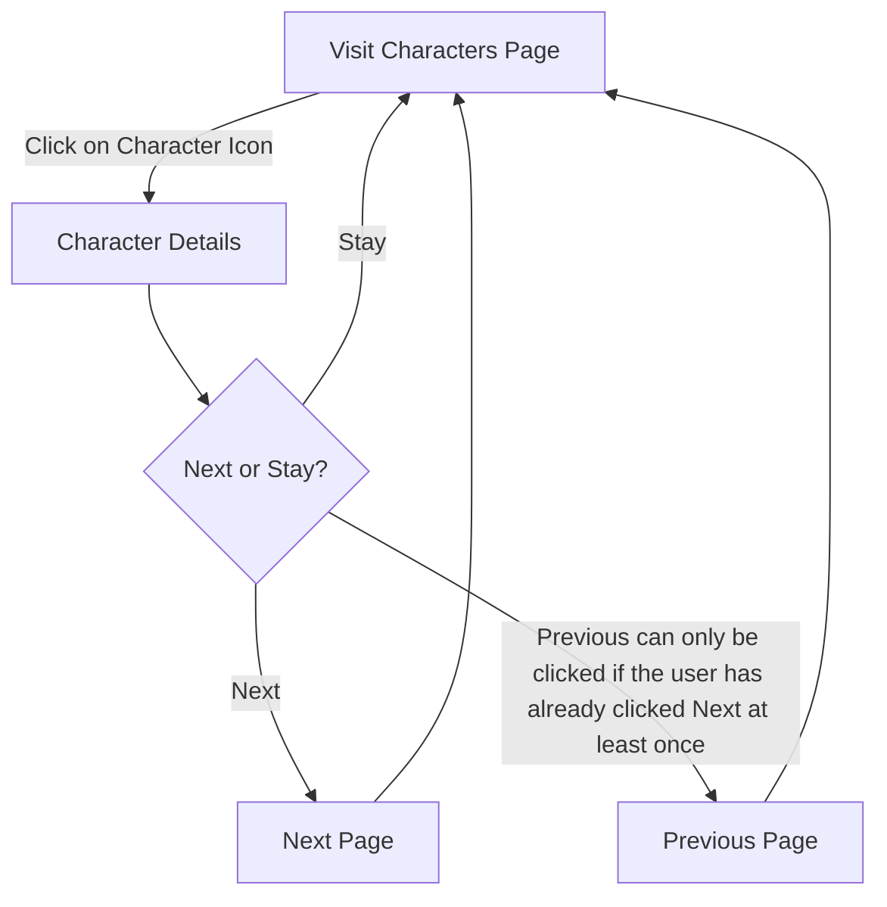
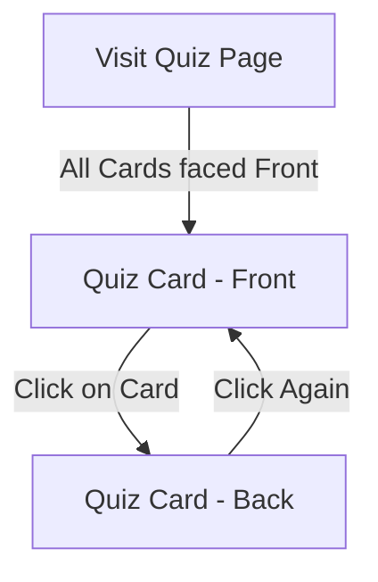
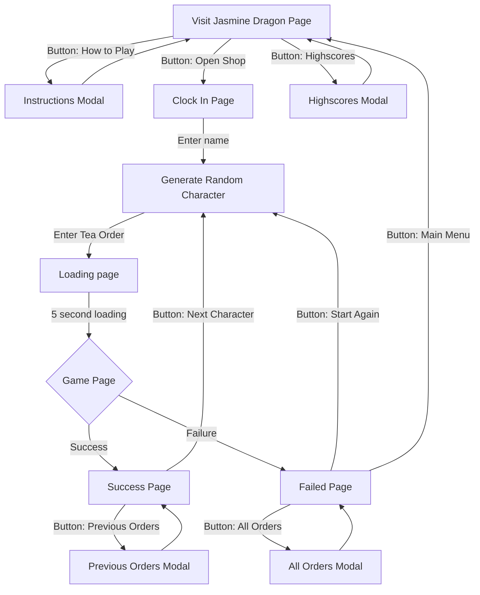

# Overall Website 

```mermaid
flowchart TD
    A[Visit Landing Page - Home Page] -->|Choose Home Page| B[Home Page]
    A -->|Choose Characters Page| C[Characters]
    A -->|Choose Quiz Page| D[Quiz]
    A -->|Choose Jasmine Dragon Page| E[Jasmine Dragon]
```

# Characters

```mermaid
flowchart TD
    A[Visit Characters Page] -->|Click on Character Icon| B[Character Details]
    B --> C{Next or Stay?}
    C -->|Stay| A
    C -->|Next| D[Next Page]
    C -->|Previous can only be clicked if the user has already clicked Next at least once| E[Previous Page]
    E --> A
    D --> A
```

# Quiz

```mermaid
flowchart TD
    A[Visit Quiz Page] -->|All Cards faced Front| B[Quiz Card - Front]
    B -->|Click on Card| C[Quiz Card - Back]
    C -->|Click Again| B
```

# Jasmine Dragon

```mermaid
flowchart TD
    A[Visit Jasmine Dragon Page] -->|Button: How to Play| B[Instructions Modal]
    A -->|Button: Open Shop| C[Clock In Page]
    A -->|Button: Highscores| D[Highscores Modal]
    B --> A
    D --> A
    C --> |Enter name| E[Generate Random Character]
    E --> |Enter Tea Order| F[Loading page]
    F --> |5 second loading| G{Game Page}
    G -->|Success| H[Success Page]
    G -->|Failure| I[Failed Page]
    H --> |Button: Previous Orders|J[Previous Orders Modal]
    J -->H
    H --> |Button: Next Character|E
    I -->|Button: Start Again| E
    I -->|Button: Main Menu| A
    I -->|Button: All Orders| K[All Orders Modal]
    K --> I
```
