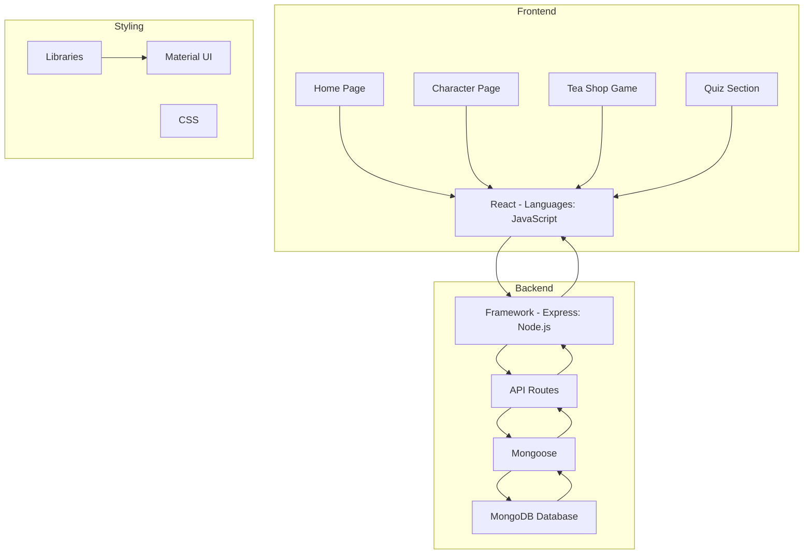
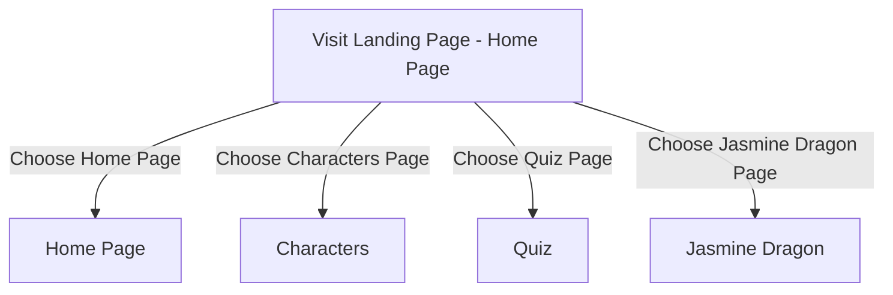
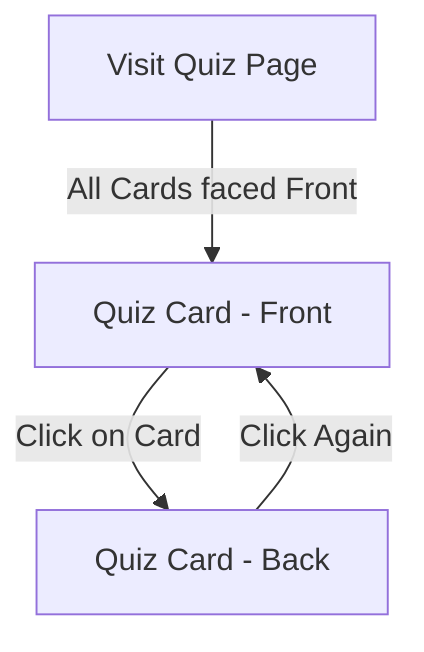
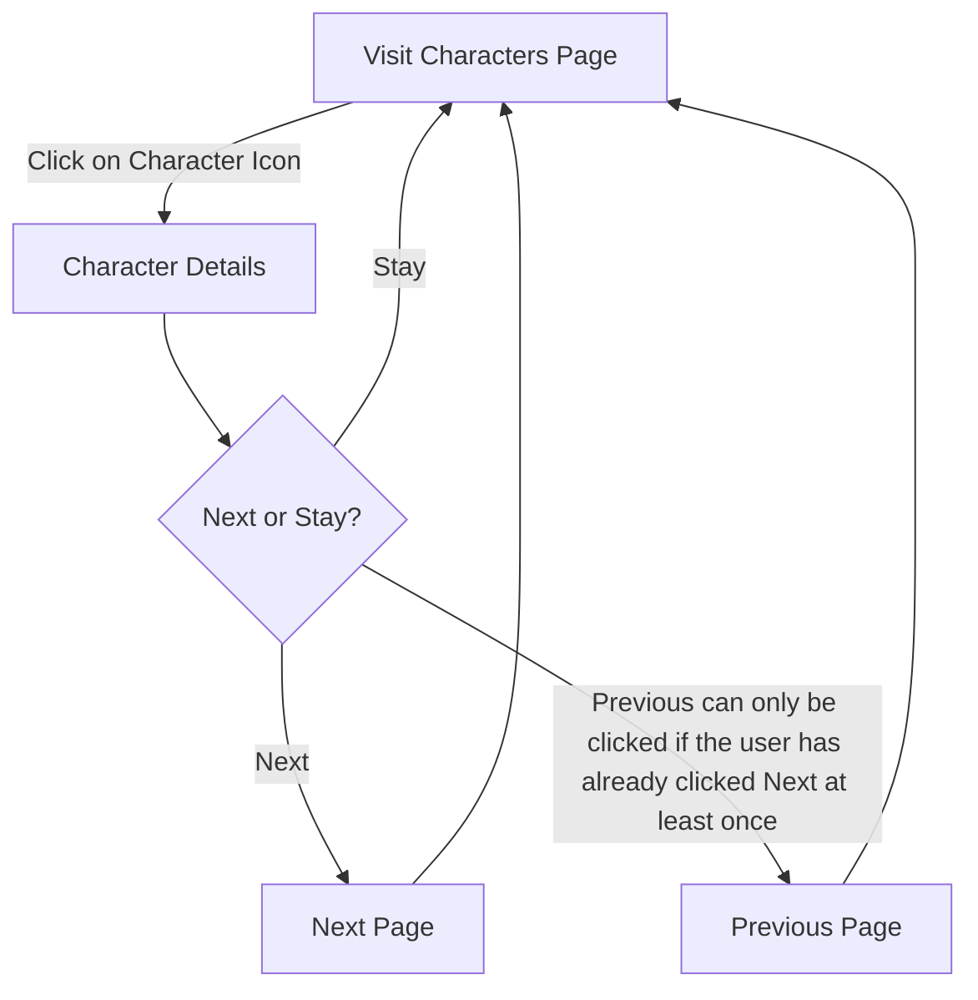
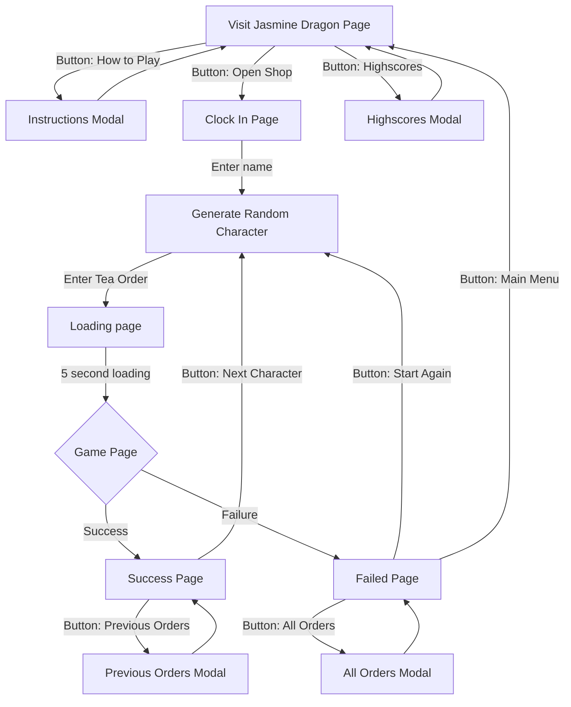
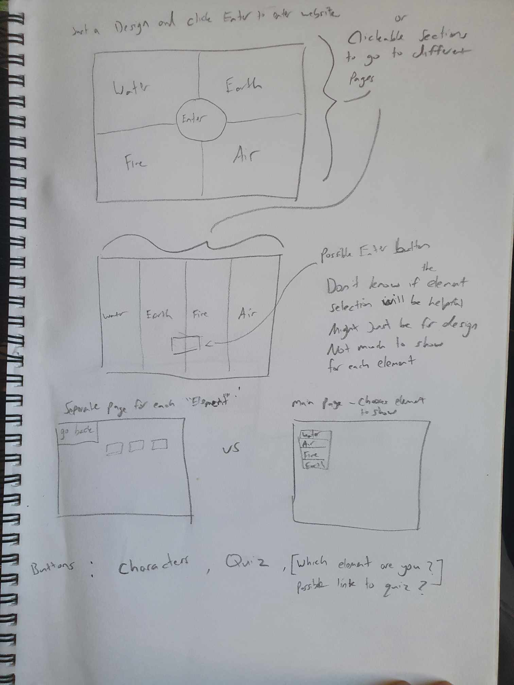
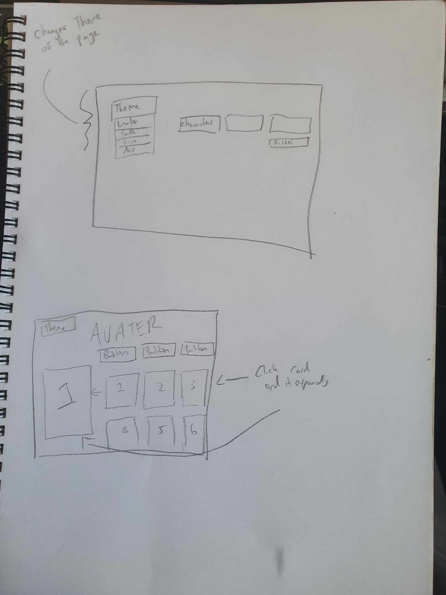
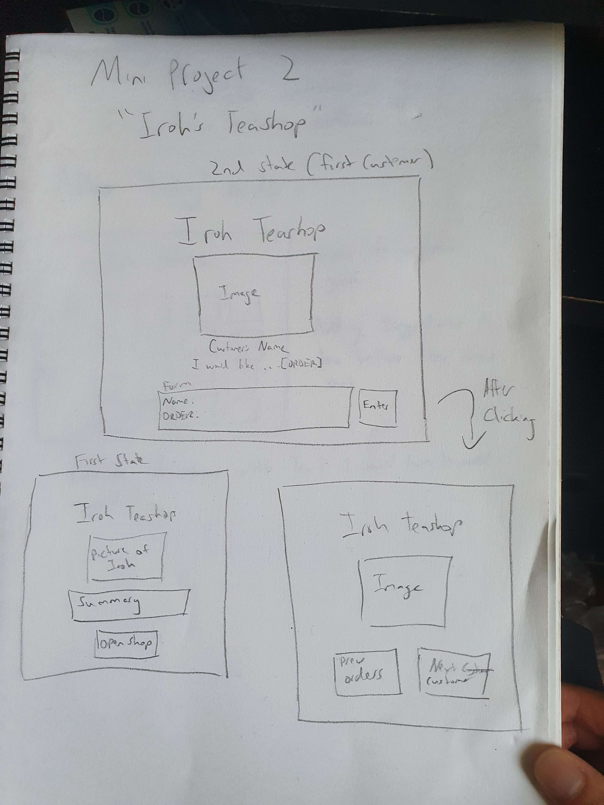
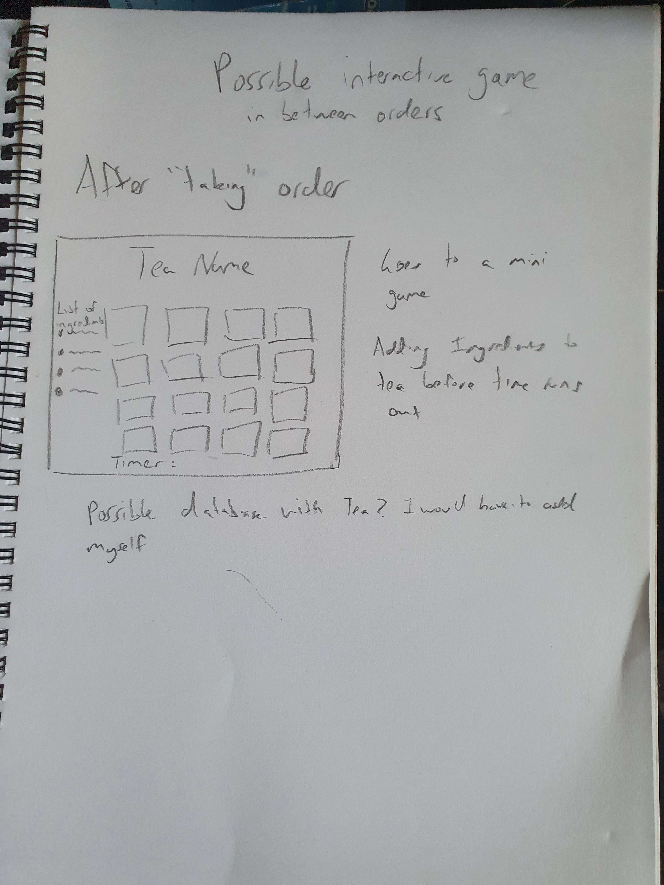
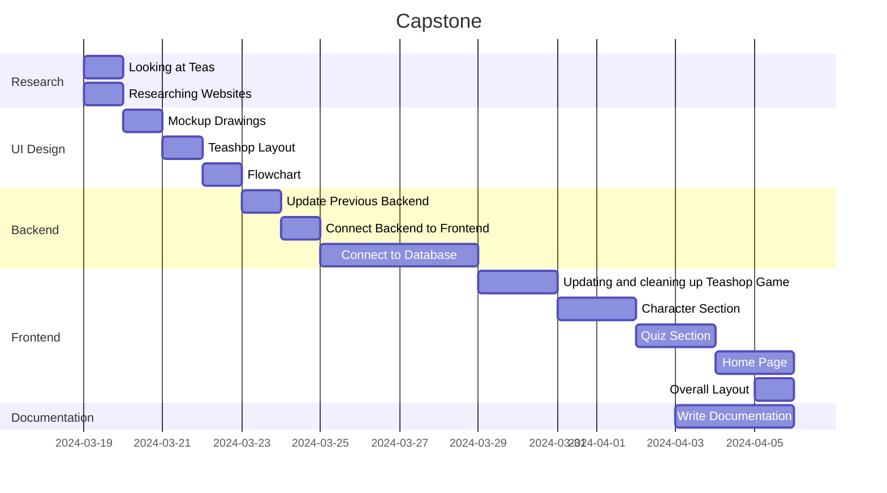

># Project Name: Avatar Universe Hub

**Description:**

The Avatar Universe Hub is a website dedicated to educating and engaging fans of the acclaimed animated series "Avatar: The Last Airbender" and its sequel "The Legend of Korra." The website serves as a platform where fans can immerse themselves in the lore and the world of Avatar by offering a diverse range of content, including character profiles, quizzes, and even an interactive teashop game. The website aims to enhance user engagement, foster a sense of community, and serve as the ultimate destination for fans seeking to explore and celebrate the world of Avatar.

**Key Features:**

Character Database: Explore profiles of beloved characters from both series, including their affiliation, allies, and enemies. Users can browse through an extensive catalog of characters, from iconic protagonists like Aang and Korra to memorable antagonists like Azula and Zaheer.

Quiz Section: Test your knowledge of the original series "The Last Airbender" an interactive card game, with questions on one side, and the answer on the other.

Jasmine Dragon Teashop Game: Dive into an interactive teashop game where you can play as a server at the Jasmine Dragon, fulfilling orders and mastering the art of tea-making by making sure you use the correct ingredients before the time runs out.

By offering a diverse range of content, the website aims to enhance user engagement and serve as the ultimate destination for fans seeking to explore and celebrate the world of Avatar.

**Conclusion:**

The Avatar Universe Hub is designed to be more than just a website—it's a gateway to the captivating world of Avatar, where fans can immerse themselves in the vibrant characters, and profound themes that have captivated audiences around the globe. Join us on a journey through the four nations, where adventure, friendship, and destiny await!

  
### How to install and run
Need Dockerhub + MongoDB container + Bruno 
1. Clone the repository:
2. Navigate to frontend directory (cd frontend): 
3. Install dependencies: 
    - npm install 
4. Navigate to backend directory (cd backend)
5. Install dependencies:
    - npm install 
6. Open Dockerhub and run the MongoDB container
7. Connect to deployment on MongoDB Compass 
8. Open Bruno and run "getCharactersFromAPI" and "getQuestionsFromAPI" in CapstoneBruno -> API (this will fill in the collections with data)
9. In the current backend directory, enter "npm start" in the terminal to start and run the server.
10. Navigate to frontend directory (cd frontend), and then enter "npm run dev" to run the environment.
11. Enjoy the website!

  

**Purpose:**

The goal of this website is to educate people, existing fans or not, on the world of Avatar, through it's lore and amazing story telling shown in both Avatar: The Last Airbender and it’s sequel The Legend Of Korra. There will be multiple sections with content related to the series, with information ranging from the characters, to quizzes to even an interactive teashop game.

The problem is valuable to address because it provides a centralized and immersive experience for fans of the series. By offering character data, quizzes, and interactive experiences all in one website, it can enhance user engagement (through simplicity) and foster a sense of community among fans

The desired state of this project is to have a well-organized and easy to use website that serves as the go-to destination for fans of "Avatar: The Last Airbender" and "The Legend of Korra." This includes satisfying user needs for character information, quizzes, and interactive experiences, ultimately leading to increased user satisfaction and engagement.

While there may be other websites or projects related to "Avatar: The Last Airbender" and "The Legend of Korra," this project will focus on more using interactivity, in combination with the data, to enhance user experience and engagement.

The industry/domain would fall under entertainment and media, with areas in film, television, animation and gaming.

The stakeholders who will have access to this website will be everyone, whether they are an existing fan or not. This will be suitable for everyone if they are interested in learning about this series. 

The stakeholders will expect the software to deliver a seamless user experience and opportunities for engagement. They will also expect the software to uphold the values and integrity of the series.

---

>## Product Description
**Architecture Diagram**

**Web Browser:**

The interface which users interact with your application.

**Frontend (React):**

Contains different pages of this application, including the Home Page, Character Page, Tea Shop Game, and Quiz Section. This is where the user interface is rendered and where users interact with the features of your application.

**Backend (Node.js):**

Consists of the server-side logic of your application built with Node.js and the MVC Express framework. It handles client requests, processes business logic, and communicates with the database.

**Database (MongoDB):**

Stores the data used by your application, such as information about characters, quiz questions, and the orders and scores for the teashop game. MongoDB is used as the database management system, and it's accessed and manipulated by the backend server using Mongoose, an ODM library.

**Product Features**

Users will be able to click to multiple pages that will show them different information about the shows. There is a character page where it shows all characters and the user can click on a character to view more of that character’s information. There is an interactive quiz section where it shows questions in forms of cards, which can be flipped when clicked, to show the answer. There will also be a home page, which will have a summary of each show and an interactive teashop game, where the user will play as a new employee taking orders and making tea in between.

**User Classes and Characteristics**

Overall:
- As a user, I want to be able to click on the buttons to navigate to different pages.

Character Page:

- As a user, I want to be able to click on a character icon and have it open up with information about that character (on the same page)
- As a user, I want to have a pagination feature with button to only see 20 characters per screen.

Quiz Page:

- As a user, I want to be able to click a “question” (in the form of a card) in the quiz section and have it flip (with animation) to reveal the answer.

Interactive teashop game:
- As a user, I want a button to show the instructions on how to play the game.
- As a user, I want a button to show the highscores.
- As a user, I want to be able to enter in a name to save with my final score.
- As a user, I want to be able to enter an order for a random generated character
- As a user, I want to be able to play a game where I have click the right ingredients before the time runs out.
- As a user, I want to be able to restart the game with the same name when i fail.
- As a user, I want to be able to go back to main menu after i "fail" the round.
- As a user, i want to be able to see all orders when i "fail" the round.
- As a user, I want to be able to move to the next customer after “winning” the round.
- As a user, I want to be able to view all completed orders after each completed round/winning the round.

**User Flow**

Diagrams of user flow here:

**Overall Website**

**System Feature 1 - Quiz Section**

**Primary actor:** User 

**Secondary actor:** N/A

**Description:** Users can read the questions on each card, and then click the card to reveal the answer behind.

**Basic Flow:**
1. User lands on the quiz page.
2. User sees all the questions on each card
3. User clicks on a card
4. User watches the card "flip" and reveals the answer behind

**System Feature 2 - Characters page**

**Primary actor:** User 

**Secondary actor:** N/A

**Description:** Users can click on a character icon and have it expand to show more information.

**Basic Flow:**
1. User lands on the character page.
2. User sees all the character icons.
3. User clicks on an icon.
4. User sees an expanded section with more information about the character

**System Feature 3 - Interactive Teashop game**

**Primary actor:** User 

**Secondary actor:** N/A

**Description:** Users can play as a “tea shop employee” and take orders and then play an interactive game where they have to click each correct ingredient.

**Basic Flow:**
1. User lands on the interactive tea shop page (named “Jasmine Dragon”).
2. User sees the buttons “Open Shop”, “How to play” and “Highscores”
3. User clicks on “Open Shop”
4. User lands on another page to clock in (enters in the name to be saved in the scores)
5. Users lands on another page which a customer shows up with an order, and the user has to enter in the order.
6. User lands on another page where it has a 5 sec countdown, prepping them with the ingredients.
7. User lands on the tea creating page where the user has 10 seconds to click all the correct ingredients
8.If user succeeds, gets taken to a “Success” page where user can view previous orders or go to the next customer. If user fails, gets taken to a “fail” page where user can view all orders, restart the game with same name, or go main menu.

**Wireframe Design**

Website Design

Teashop Design

**Open Questions/Out of Scope**

User Authentication:

I did not want to add in any type of authentication feature as the primary focus of my website was to engage users in the many interactive features, and i believed there was no need for that.

Social Media:

As my website could be called a database, i felt like there was no need to add any social media integration, but in the future there could be a chance to implement those integrations. Also as stated above, with no users, i believe there would be no point in just linking social media accounts without a user feature.

**Non-functional Requirements**

Application Response Time:

This aspect is essential for ensuring a smooth user experience. Users expect quick responses when interacting with your Avatar project, whether it's loading character details, submitting quiz answers, or browsing through the application. Responsiveness contributes to user satisfaction and engagement.

Conformance to Technical Standards:

Adhering to technical standards can enhance the maintainability of this project. This might involve using established frameworks (such as MVC) following coding conventions, adopting industry best practices, and ensuring compatibility with relevant technologies and platforms. Conforming to these standards can facilitate collaboration, code reuse, and future updates. By using both MVC Express and React, there will be well-defined coding conventions and patterns that are typically followed.

Compatibility:

The application should be compatible with a range of browsers, and operating systems. This ensures that users can access the application seamlessly regardless of their preferred platform. No devices for this application as the interactive game shop is required to be played on browser.

---

>## Project Planning:
**Gantt Chart**

---

>## Testing:

For the characters section, one main problem that came up was data error, more specifically broken image urls. To fix this, in the backend i made it so that it grabs all data with the response status of 200, so it will not take in the broken images. I then did the opposite and used Bruno to attempt to filter out the broken images and to see if the way I was going about it would work. I would use Bruno and Mongodb to test, Mongodb to clear my collection everytime and Bruno to fill in the collection with the data.

For the quiz section, it was similar to the characters section, but one problem was the dataset had a mispelt word. I discovered this when i kept have errors and then i realized that the fieldname in the actual data was wrong. Therefore i came to the conclusion it was wise to grab all data to the database, and through that process i was able to change the name so that whenever i used it in the frontend, i would not need to use the mispelt word. 

For the interactive tea game section, I went through a lot of testing, as there was a lot of this. I first made sure that the dataset of tea and their ingredients were being passed in properly, and through that arrays were being compared to make sure that what was clicked were the required ingredients; I  had buttons of each ingredient (through indexing) click which added the ingredient to any array and use that too compare with the dataset. I had added a lot of console.logs for each step to make sure all the correct data was being sent. 

For overall front end and backend , I used a lot of console.log to make sure data was being sent and retrieved, whether it was from front end to backend (and vice versa), frontend to database or even backend to database. Console.log also helped to make sure all manipulation operations worked as intended.

For all my features, I used Bruno to make sure the right data were being sent, when there were unknown errors (to make sure it wasn't the link itself or the database), and to make sure they were correctly populating the database. The only routes I needed to test in Bruno were:

- CapstoneBruno->API
    - getQuestionsFromAPI
        - This was to test if the actual data from the API was being sent and stored in the collection, and since it works now that is the purpose of it.
     - getCharactersFromAPI
        - This was to test if the actual data from the API was being sent and stored in the collection, and since it works now, it is now the purpose of this.
- CapstoneBruno->Characters
    - getCharactersFromDatabase
        - This was to test the query params and see if the number for perPage was being sent, and was to test if pagination would actually work as intended (now being used)
- CapstoneBruno->Questions
    - getQuestionsFromDatabase
        - This was to test if the data (questions) was being called properly, and is now being used to do that.
- CapstoneBruno->Tea Orders
    - getTeaOrders
        - This was to test if orders were being sent and stored correctly in the collection, and is now being used to do that.
    - createOrder
        - This was to test if orders were being created correctly, and is now being used to do that.
    - updateStatus
        - This was used to test if status were being updated as expected, and is now being used to do that

There were also some testing that I did with MongoDB, where i would constantly check and refresh to see if data was being deleted successfully.

Through this, i was able to learn that Bruno helps a lot with routes and makes it easy to understand if the problem is client side or server side. And by seeing all the constant errors I have familiarized myself with a few, such as ones that show ".map is not a function" and that is most likely beaause the variable is not an array.

---

>## Implementations

I have considered deploying this project onto a cloud platform like AWS, so that it could fix some errors that kept showing up, but even after fixing those errors I have still given it some thought as it would be a good way to get some experience with server work and actually be able to share my website for other people to visit.

I have also used Docker to ensure consistency across environments and to simplify eployment.

I also used a .env file to store environment variables, and even though I'm not using any sensitive information at the moment, I know that i will be able to safetly store them in this file.

---

>## *End-to-end solution

The software has met most, if not all the objectives. The main objectives were the interactive teashop game (being high priority), and then the quiz and characters section, and all were completed and works as intended. Although some parts could have extra features added; such as search feature for the characters section, they will be added in future implementations. 

---

>## References used in this project:

**Libraries/Frameworks**
- React : JavaScript library for building user interfaces.
- Node.js : JavaScript runtime environment for server side development.
- Express.js : Web application framework for Node.js.
- MUI Library : React component library for UI design.
- Moment.js : Library for dates and times.
- react-router-dom : Library for declaring routes in React.
- Axios : HTTP client for making requests to APIs.
- Mongoose : Object Data Modeling library for MongoDB and Node.js.
- CORS : Middleware for enabling Cross-Origin Resource Sharing in Express.js.
- Dotenv : Module for loading environment variables.

**Database**
- MongoDB : NoSQL database

**Tools**
- Visual Studio Code : Integrated Development Environment (IDE) for code editing.
- Bruno : Testing tool used for debugging and testing API endpoints.
- Github :  Version control system and code repository for collaboration.

**Others**
- CSS : Cascading Style Sheets for styling the frontend components.
- HTML : Hypertext Markup Language for structuring web pages.

Link to Github: https://github.com/institutedata/capstone-TunaPigeon

API for character page and interactive tea shop game: https://last-airbender-api.fly.dev/

API for quiz section: https://sampleapis.com/api-list/avatar

